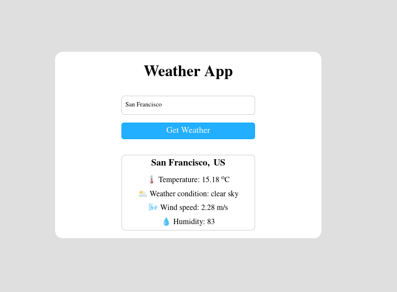

# 🌦️ Simple Weather Application

A simple **Weather Application** built using **Vanilla HTML, CSS, and JavaScript**.  
This project was created for practice purposes — mainly to understand **asynchronous JavaScript**, how to use the **Fetch API**, and how to work with server data in real-time.

🔗 **Live Demo:** [View Website](https://live-weather-oms-projects-a56c5f86.vercel.app/)  
🔗 **GitHub Repo:** [Simple Weather Application](https://github.com/om-dev007/Simple-Weather-Application)

---

## 🚀 Features

- Search weather details by **city name**  
- Displays:
  - 🌡️ Temperature  
  - 🌥️ Weather condition  
  - 🌬️ Wind speed  
  - 💧 Humidity  
- Clean and responsive UI  
- Uses **OpenWeatherMap API** for live data  

---

## 🛠️ Tech Stack

- **HTML5** – Structure  
- **CSS3** – Styling (Responsive)  
- **JavaScript (ES6)** – Logic & Fetch API  

---

## ⚙️ How It Works

1. Enter the city name in the input field.  
2. The app sends a **GET request** to the [OpenWeatherMap API](https://openweathermap.org/api).  
3. The response data (JSON) is processed using **JavaScript**.  
4. Weather details are dynamically displayed in the UI.  

---

## 📦 Installation & Setup

To run this project locally:

```bash
# Clone the repository
git clone https://github.com/om-dev007/Simple-Weather-Application.git

# Navigate into the folder
cd Simple-Weather-Application

# Open index.html in your browser
```

✅ No external dependencies required.

---

## 📸 Screenshots



---

## 🎯 Learning Outcome

- Practiced **asynchronous JavaScript**  
- Learned to use **fetch()** for API requests  
- Worked with **JSON data**  
- Gained experience in **DOM manipulation** and **UI updates**  

---

## 🌐 API Used

- [OpenWeatherMap API](https://openweathermap.org/api)

---

## 🤝 Contributing

This is a beginner-friendly project.  
Feel free to **fork** the repo and create pull requests for improvements.

---

## 📜 License

This project is licensed under the **MIT License** – free to use and modify.
